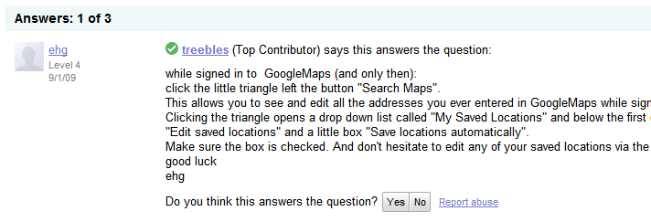

포럼 지원
##########

API 제공 업체의 주요 목표는 서드파티 개발자들이 여러분의 API를 성공적으로 사용하는 것이다.  원래는 개발자는 직접 문서를 읽고, 샘플코드를 참고하여 생각하는 애플리케이션을 정확하게 작성할 수 있다. 그러나 세상은 완벽하지 않고, 구체적이지 않기 때문에, 여러분의 API는 완벽하지 않고 문서도 100% 완성될 수 없다. 사실, 개발자들이 어떻게 API를 사용하길 원하는지 예측하는 것은 불가능에 가깝고, 사용 가능한 무수하게 많은 모든 방법을 문서화 하는 것은 불가능에 가깝다. 때문에, 질문을 하고 애플리케이션 디버깅을 도와주기 위한 포럼을 제공 함으로서 여러분의 개발자들을 도와야 한다.

시간이 많다면 최종 목표는 그룹 안의 자주 물어보게 되는 질문들과 유즈 케이스를 모두 다루는 문서를 만드는 것이 될 것이다. 하지만 자원은 한정된다면 포럼 지원을 효율적으로 제공하는 것이 개발자들을 직접적으로 도와 줄 것이다.

API 지원 포럼의 궁극적인 목표는 사용자 커뮤니티를 구축하는 것 그리고 이러한 사용자가 서로 도울 수 있도록 하는 것이다. 게시글의 대부분을 API에 대해 열정적이고 다른 사람들을 도와주는 것을 즐기는 핵심 사용자가 답변하도록 하는 것이다.

포럼 기능
**********

포럼에서 지원하는 기능은 여러 가지가 있으며, 각각의 포럼들은 별도의 서로 다른 기능을 가지고 있다. 다음은 몇 가지 표준 기능이다.

* :ref:`email-subscription`: 만약 여러분이 메일에서 개발자 소통을 원한다면, 메일을 서로 쉽게 나누는 방법이다.
* :ref:`rss-feeds`: 일상적인 개발자들은 RSS 피드들을 선호할지 모른다. 그들이 필요 할 때 메일 스레드를 열람할 수 있다.  
* :ref:`spam-handling`: 공개 포럼들은 스팸에 취약하기 때문에 억제는 필수 요소이다.
* :ref:`poster-statistics`: 눈에 보이는 통계가 있다면 개발자들은 더 많이 글을 쓰게 된다.
* :ref:`badging-system`: 뱃지시스템은 더 효과적인 참여를 이끌어 낸다.

다음은 선택 가능한 포럼 서비스이다.

* `Google Groups`_: 이메일, RSS, 스팸 처리를 포함하지만 통계나 뱃지는 충분하지 않다.
* `Stack Overflow`_: 전체 기능과 훌륭한 계층 뱃지 시스템. 주 결점은 모두 하나의 큰 포럼이고 특정 API를 중심으로 커뮤니티를 형성하는 것이 힘들다는 것이다.
* `GetSatisfaction`_: 전체 기능 과 글 쓰기 특별한 기능 제공. 질문, 아이디어, 버그, 칭찬 게시글들을 구분하고, 유사한 질문을 찾을 수  있다. 게시자에게 게시 방식 팁을 주고, 태그 추가와 게시글에 대한 느낌을 격려한다.
* `phpBB`_: 전체 기능을 제공하며, 오픈소스이며 웹에서 구동되는 가장 많이 사용하는 시스템 중 하나이다.
* `ZenDesk`_: 전체 기능과 1대1 고객 지원 티켓이나 글로 스레들을 설정하는 기능을 포함한다.

*(역자주) 국내에서는 네이버, 다음, 네이트 3개사 모두 오픈 API 지원을 개별 카페를 이용하고 있다. 커뮤니티 기능이 잘 갖추어져 있으면서 등록 아이디를 사용하므로 오픈 및 제휴 개발자 지원이 용이하기 때문이다*

주로 사용해 보았던 포럼의 기능들은 아래에서 좀 더 자세히 논의할 것이다.

.. _Google Groups: http://groups.google.com
.. _Stack Overflow: http://stackoverflow.com
.. _GetSatisfaction: http://getsatisfaction.com
.. _phpBB: http://phpbb.com
.. _ZenDesk: http://zendesk.com

.. _email-subscription:

이메일 구독
============

경험에 비추어 봤을 때, 개발자 포럼의 가장 중요한 특징은 사용자들은 이메일을 통해 회원 가입을 하고, 답변을 받을 수 있다는 것이다. 이는 질문을 하고 답을 받는 진입 장벽이 낮으며, 이메일 혹은 뉴스 그룹 리더를 선택하여  그룹안의 사람들을 관리할 수 있다.

어떤 포럼은 이메일 구독을 제공하지 않을지 모르지만, 포스팅에 답변을 하거나, 매주 콘텐츠의 요약을 사용자에게  이메일로 보내줄 수이다. 옳은 방향이기는 하지만 사용자들이 모든 무작위한 메일에 답변을 하도록 하기는 어렵다.

.. _rss-feeds:

RSS 피드
=========
최근 주제들과 포스트들을 구독 하는 기능이 제공된다면 좋다. 어떤 개발자는 이메일을 통한 구독을 즐겨 하지 않고, RSS 피드를 리더에 붙이고 가끔씩 쳐다본다. RSS 피드 (#주어진 기간에 게시물의)를 API 방문 페이지에 달아 두고 통계를 분석해 볼 필요도 있다.

.. _spam-handling:

스팸 처리
==========

개발자 포럼은 많은 회원을 가입하도록 일반적으로 열려 있다. 문서, 블로그 포스트, 이슈 트래커로 연결되어 있으며, 가입자 승인이 크게 필요하지 않다. 커뮤니티 활동 장려에 좋지만, 사실 스패머가 활동하기에도 좋은 환경이다. 스패머들은 잠재적으로 커뮤니티를 파괴할 수 있다. 여러분이 그룹을 구독하고 다음날 5개의 스팸 메시지를 받는다면, 아마 이렇게 생각할 것이다. "받은 편지함에서 스팸메시지를 받아야 한다면, 이 사이트에서 탈퇴를 해야지"라고.

대부분 포럼 소프트웨어는은 스팸 탐지 기능을 가지고 있고,  포럼으로 들어오는 모든 스팸메세지를 막거나, 여러분이 허용/거부하는  대기 장소로 보낼 수 있어야 한다. 만약 어떠한 이유로 메시지가 통과 한다면, 메시지를 지우거나 포스터 금지 시키기가 쉬워야 한다.

그러나 많은 포럼들은 완벽한 스팸 방지기능을 가지고 있지 않기 때문에, 스팸 방지에 도움이 되는 적당한 기능을 제공한다. 예를 들면, Google Groups은 누구나 쓰거나, 신규 사용자의 첫번째 글만 관리하거나, 모든 게시글을 관리자가 직접 승인하는 옵션이 있다. High-spam-target Maps API 그룹은 높은 트래픽 때문에 두번째 옵션을 선택했다. 

그룹에 가입한 개발자는 게시물이 검토 되는데 너무 오랫동안 기다리지 않도록 하기 위해 전 세계에서 미국, 영국, 호주 관리자들이 있다. 일부 매니저들은 구글에서 일하지만 그들 대부분은 우리가 신뢰할 수 있는 상위 회원들 이다. 접근 권한을 누구에게 주었는지 주의하고, 포럼의 기준을 지키지 않으면 스팸이 아니더라도 포럼에 글을 게시하는 것이 거부할 수 있다.

혹시 게시를 해야할지 난감하면 일단은 통과 시켜라. 그룹에서 검열을 한다고 알려지면 별로 도움도 되지 않고 매주 하나 혹은 두개 스팸 게시물을 올린다고 손해를 크게 끼치지는 않는다.

.. _poster-statistics:

글쓴이 통계
============

일반적으로 사람들은 상을 받거나 높은 점수를 얻고 그게 보여지는 것을 좋아한다. 약간 바보같고 자기 중심적일지도 모르지만, 사람들의 일반적인 특징이기 때문에 포럼은 더 많은 게시물을 작성하도록 하기 위해서 사람들을 격려하는 기능을 넣을 필요가 있다. 어떤 포럼에서는 가입 날짜와 게시물 수를 노출 하는 기본 통계를 제공한다. (누가 오래된 사용자인지 알 수 있다). 이는 더 많은 포스팅을 하도록 격려하고 새로운 사람들에게 스레드 안에 있는 다른 사람의 경험 레벨을 이해 시켜줄 수 있다.

아래 스크린샷은 실제 사용되는 PHPBB 표준 설치 화면을 보여준다. 각 게시물에 작게 보이는 사용자 프로필은 아바타, 가입일, 게시물 수를 보여준다.

|phpbb|

.. Ref: http://area51.phpbb.com/phpBB/viewtopic.php?f=72&t=31310

그러나 기본 통계는 속일 수 있다는 것을 명심하라. 사실 누구나  1,000개의 정보 없는 게시글을 게시할 수 있다. (또는 질문만 달아 도움만 얻는 사용자일 수 있다). 다행히 대체적으로 이런 경우는 별로 없다. 초보 개발자가 덜 커뮤니케이션하고 좋은 개발자가 되거나 하지 않기 때문이다.

드물게 규칙을 지치기 않는 유해한 개발자가 나타날 것이다. Map API 그룹에서 스팸글을 쓰는 사람이 아닌 사람이 있었다. 틀린 내용을 담고 있었고 관계 없는 스레드에서 자꾸 글을 쓰는 것이다. (일반적으로 “hijacking” 이라고 한다.) 포럼의 다른 사람들은 그에게 친절하게 포럼 사용법을 가르쳐 주려고 노력했다, 그가 사람들의 의견을 듣지 않는다는 것이 분명해진 후, 나는 그를 영구제명 하고 그에게 가이드라인을 지키면 다시 글을 쓸 수 있다는 알림 메일을 보냈다. 스팸이 아닌 사람을 처음 금지시킨 것이지만 나는 이런 방식도 필요하다고 생각한다.  그는 커뮤니티에 도움이 되지 않았했고, 스스로 복귀를 거절했다.

다른 한편으로 매우 뛰어난 개발자인데 별로 글을 안쓰는 사람이 있다. 특정 분야에 뛰어난 사람일 수록 이런 경우가 자주 있는데 특별한 글에만 답장을 하고 사람들이 뜸한 시간에 와서 가끔 글을 쓰는 사람이다. 따라서, 통계만으로 좋은 개발자를 찾기는 어렵고 몇 개 되지 않은 글의 질로서 그러한 개발자를 가려내어야 한다.

만약 포럼이 글을 평가하는 기능을 제공한다면, 게시글의 평균 순위에 대한 통계가 가능하다. 그러나, 사용자 평가는 위험요소이다. 누가 게시글에 자주 좋은 대답을 하는지 구분하는데 사용될 수 수 있지만, 종종 나쁘게  이용될 수도 있다 -  원하는 대답이 아닐 경우, 좋지 않다고 평가 하기 때문(글의 내용이 올바른 경우에도). 자바스크립트 API 포럼에서 플래시 API에 대한 내용을 알렸을때 가장 낮은 게시글 평가를 받았었다. 

그 포럼에는 플래시를 매우 싫어하는 하드코어 자바스크립트 개발자들이 많다는 것을 알았고, 심지어 그런 말을 하면 더 싫어할지도 모른다. 게시글에 일반적인 별점을 제공하고, 평가에 대한 어떠한 지침을 제공하지 않았을 때 생기는 근본적인 결함이다. 원래는 “답변이 도움이 되었는가?”가 되어야 하지만, 어떤 사용자는 “게시글이 기분 나쁘게 만들었는가?”라는 의미로 받아 들이고 평가하기 때문이다. 아래의 스크린샷은 Google Groups의 문제를 경험한 평가 인터페이스를 보여준다:

|groupsrating|

.. Ref: http://groups.google.com/group/google-maps-js-api-v3/browse\_thread/thread/8b1c45197229950b

원래 포럼은 게시자에게 피드백 방법에 대한 많은 가이드를 제공해야 하고, 이를 통해 더 좋은 결과를 가져올 것이다. Google Maps의 경우,  질문-답변 상황을 타겟으로 하는 기능을 가지고 있다. 예를 들어, 어떤 질문에 대해 쓴 글에 대해 '질문에 대한 적절한 답변이라고 생각하십니까? 예/아니오'라는 기능을 추가함으로서  좋은 답변을 찾고 게시자의 좋은 통계로 삼을수도 있다. 물론 명확하진 않다. 아래 스크린샷은 질문에 대한 답변에 표시되는 방법을 보여준다:

|u2urating|

.. Ref: http://www.google.com/support/forum/p/maps/thread?tid=12cf111e77d6b0d4&hl=en

프로그래밍 이슈에 대한 특별한 포럼인 Stack Overflow는 최고의 평가 인터페이스를 제공한다. 아래  각각 포스트는 위 아래 화살표가 보여진다. 화살표 위로 올라가면 '이 답변은 도움이 됩니다.'라는 의미이고 그 반대는 “이 답변은 도움이 되지 않습니다” 라는 툴팁이 보여져서, 사용자들은 이것이 투표를 의미하는 지를 알수 있다. 

더 자세히 말하면  15점 이상의 등급을 가진 사람들만 모든 투표가 가능하다. 개발자들은 좋은 질문 또는 좋은 답변으로 평판 점수에 참여하고, 약간 도움이 되는 게시글들이 15점을 쉽게 가져가기 때문에 이 제한은 비교적 낮다. 신규 사용자들은 투표를 할 수 없기 때문에 화나게 할지 모르지만, 사용자를 인증하는 동안의 기다림을 통하여 시스템을 이해하고 커뮤니티에 공헌하는 것을 도와준다. 투표 데이터는 사용자 평판의 기반이 되며, 프로필 페이지에 자세하게 보여진다.

아래 스크린샷은 StackOverflow 페이지의 답변을 보여준다. 화살표 위로 올라갔을 때 툴팁 알림과 응답자의 작은 프로필 옆에 통계를 보여준다.

|stackoverflow|

.. Ref: http://stackoverflow.com/questions/710392/using-spring-ioc-to-set-up-enum-values

평가의 또 다른 이슈는 사람들은 긍정적인 감정일 때 보다 부정적일때 더 자주 평가를 하는 경향이 있다는 점이다. 그래서 평가는 주로 안 좋은 쪽으로 기울어지고, 데이터가 충분하지 않으면 쏠림이 해결되지 않을지 모른다. Google Groups는 많은 게시자들이 이메일을 통해 구독하기 하기 때문에 웹 인터페이스의 평가 시스템을 보지 않아 데이터가 부족하다. 웹 전용 포럼과 같이 쉽게 별표를 누르는 것만으로도 평가가 되다면 데이터가 충분히 확보될 것이다. 

웹에서는 주로 평가 위젯을 사용하는데, 이는 민주적인 방식이며 피드백을 받는 가장 간단한 방법이다. 지금까지 살펴 보았다시피, 평가는 그리 간단한 문제가 아니다. 포럼에서 별점 혹은 투표 기능을 쓸 때는 위의 내용을 명심하는 것이 좋다.

.. |groupsrating| image:: ./screenshot_groupsratings.png

.. |stackoverflow| image:: ./screenshot_stackoverflow.png

.. _badging-system:

뱃지 시스템
============

뱃지 시스템은 대안으로서 순위시스템 지원을 제공할 수 있다. 이것은 개발자 보상 목표 뿐만 아니라, 평가 문제를 피하면서, 경험 수준을 드러내는 것에 목적을 수행할 수 있다. 일반적으로 포럼은 게시자가 얻을 수 있는 다양한 뱃지 레벨을 가지고 있고, 그 레벨은 신규 회원에서부터 경험많은 개발자, 그룹 관리자까지를 커버하고, 참여에 대한 질과 양을 모두 나타낸다.

예를 들면 오픈 소스 게임 엔진인 Ogre3d는 phpBB를 사용하고, 아래의 뱃지 시스템을 사용한다.: “신규 사용자”, “익숙한 얼굴”, “정규 회원”, “베테랑”, “OGRE 공헌자”(오픈소스 커밋터), “스폰서”(프로젝트 기부자), “OGRE 전문가”, 그리고 “OGRE 중재자' 등. 그 뱃지들은 각각의 게시물의 작성자 이름옆에 보여진다. 아래의 스크린샷은 OGRE 포럼이다:

|ogre|

.. Ref: http://www.ogre3d.org/forums/viewtopic.php?f=1&t=52312#wrap
.. TODO: Encouraging top posters
.. TODO: Encouraging good posting

포스팅 지침
************

포럼의 목표는 사용자의 게시물에 의해 주도되는 것이지만, API 제공자는 항상 포럼을 모니터링 해야 하고, 질문과 답변이 원활하게 이루어지도록 해야 한다. 모든 게시물에 대한 답을 하는 것이 아니더라도 사용자들은 API 제공자의 관리를 받는 것을 느낄 것이다. 방치된 포럼보다 나쁜게 없고, 그들이 실제 여러분을 필요로 할 때 옆에 있다는 것을 보여 주어야 한다. 포럼을 모니터링하는 또다른 이유는 버그들을 찾기 위해서이다. 경험에 비추어 보면, 중요 버그는 짧은 시간 안에 포럼에 많은 반응을 가져온다. 포럼 모니터링은 주요한 버그를 찾아내는 빠른 방법이다.

포스팅 시점 결정
=====================

API 제공자가 포럼에 게시하는 두 가지 상황이 있을 것이다. 첫번째 상황은 스스로 새로운 글을 쓸 때인데 “개발자 커뮤니케이션” 부분에 자세히 설명되어 있다. 또 다른 상황은 다른 개발자가 쓴글에 대해 응답하는 것이고 여기서 다루려고 한다.

주제에 회신 여부를 결정할 때, 염두에 두어야 할 것이 두 가지가 있다. :

- 항상 외부 개발자가 스레드에 응답하는 것을 장려하고, 관리자에게 메일을 보내는 것 보다 고급 사용자들에게 묻도록 하는 것이 좋다.
- 모든 질문에 답할 필요는 없다. 디버깅 시간이 많이 걸릴 수 있고, 일부 사용자는 독특한 요구를 할 수 있기 때문이다. 긴급한 질문에 우선적으로 처리하는 것을 필요로 한다.

이러한 제약을 감안할 때, 아래 다이어그램은 포럼 응답 시 적절한 의사 결정 흐름을 보여준다.

|groupdiagram|

사용자가 게시글을 올리면, 먼저 긴급한 게시물인지 확인하기 위해 게시물을 검토한다. 일반적으로, 긴급한 메시지는 주요 기능 결함을 보이는  신호가 되고, 드물게 발생하는 것이다.(물론, 그렇지 않으면 여러분의 API가 좋지 않은 상태이다). 바로 문제 원인을 찾고 있다고 즉시 응답한다. 그렇지 않은 경우, 일정 기간 기다리고 그 시간은 다른 개발자가 게시글에 응답할 기회를 준다. 일반적으로 2일을 기다리지만, 1-7일이 될수 있다. 일단 일정기간동안 기다린 후, 게시글을 다시 검토한다. 만약 다른 개발자가 답변을 완전한 정보로 게시물에 답변을 한다면 상관없지만, 답변이 되지 않았거나, 되었더라도 잘못되거나 불분명 하다면, 대응해야할 후보가 된다.

다음 단계는 게시물이 API 제공자 응답에 대한 요건을 충족하는 지 확인하는 것이다. 요건은 바로  여러분이 가지고 있는 한정된 시간안에 가장 중요한 문제에 응답하는 것이. 다음은 업무를 할 때 나의 기준이었고, 이런 경우 바로 답변을 하였다.

- 사용자가 API나 문서의 버그를 알려 주는 경우.
- 외부 개발자들이 답변 할 수 없는 질문일 경우. 예를 들어, 누군가 지도 API 사용량을 초과하고 있다고 하면 내부에 있는 사람이 아니면 알 수 없기 때문에는 그들에게 무엇을 해야하는지에 대한 정보를 응답해 주어야 한다. 

질문이 특별한 경우나 오랜 기간 동안 자주 올라와도 답변이 없는 경우, 답을 해 주어야 한다. 개발자들이 검색을 통해 답을 찾으려 할 때, 답변이 없는 주제들을 보면 좌절 할 수도 있기 때문이다.

답변 작성
===========

여러분이 답을 해야 하기로 결정했을 때, 작성할 때 따라야할 몇 가지 팁이 있다. 

- **친근하고 일상적인 용어 사용하라** 절절히 고맙다고 말하고, 이모티콘을 사용하는게 좋다. 포럼을 긍정적인 장소로 만들어야 한다는 점을 기억하라.
- **답변에서 글쓴이를 언급하라** 좀더 개인적이고 배려하는 것처럼 보이게 하지만, 답변이 여러 그룹으로 나뉠때 쉽게 읽을 수 있도록 만든다. 게시글에 실명을 사용하면 그것을 불러주고, 아니면 아이디를 써도 된다.  예) "안녕하세요. 석찬님 - " 또는 "안녕하세요. Channy님 - ".
- **답변을 간결하게 만들어라** 웹에서는 아무도 긴 글을 읽으려 하지 않는다. 하지만, 답변을 너무 짧게 하면 추가 질문을 만들기 때문에 적당하게 답변한다.
- **가능하면 정보를 찾도록 하라** 개발자가 질문하면 대개 답이 문서의 어딘가에 있다. FAQ, 데모, 샘플 코드 등- 사실 그들이 질문한다는 것은 해당 부분의 문서를 읽지 않았다는 것을 의미한다. 이는 잘못된 행동이 아니다. 문서는 본다고 해서 숙지하기 쉽지 않다. 개발자들에게 문서를 읽도록 격려할 필요가 있고, 답변에서 그 위치를 알려주면 좋다. 
-  **코드만 게시하지 말고 설명을 해라** 많은 질문 중 어떻게 X와 Y를 하는지를 물어 볼 것이다. 이것은 그들에게 코드를 제공하도록 한다. 그러나 샘플 코드를 준다고 해서 좋은 개발자로 만들지 못한다. 무임 승차하는 개발자로 만들고, 포럼을 코드 완성을 하기 위한 지원 받는 곳 쯤으로 생각하게 만든다. 대신, 소스 코드와 숨겨진 원리 설명을 주고, 적어도 회원들이 직접 배울 수 있는 기회를 주는게 좋다.
- **감정에 사로잡히지 말라** 어떤 개발자들은 포럼에 감정적인 글을 쓰는 사람이 있다. 예를 들어, 버그가 있음을 알릴 때 등. 이 때, 같이 감정적인 답변을 하는 것은 상황을 악화시키는 것이다. 여러분의 능력을 최고로 발휘하여 기술적 문제를 해결하고 있음을 정중하게 알리면 된다.
- **미래를 예측하지 말라** 여러분의 API를 사용하는 개발자들은 미래의 두 가지 사실에 흥미가 있다: 1) 버그가 수정되는 것 혹은 2) 기능이 실현 되는 것. API 제공자로서 기능 구현에 대한 일정에 대한 계획을 알리거나 약속하는것은 매우 위험하다. 여러분의 해야할 일 목록이기는 하지만, 내부에서 어떤 장애물이 있을지 모르기 때문이다.  (현실적으로 더 빨리 끝내야할 기능을 찾는다). 여러분이 “네. X일내에 처리해 드리겠습니다”라고 말하고 그 날짜에 해결을 하지 못하면 믿음을 잃게 된다. “좋은 생각입니다. 확인해 보겠습니다'라는 편이 더 낫고, 빨리 기능을 제공해서 개발자들을 놀래키는 것이 더 낫다. 그러나, 버그 수정은 조금 다른 얘기이다. 1) 개발자는 해결에 얼마나 더 기다려야 하는지 예측해야 한다. 2) 버그가 여러분의 실수라면, 버그를 수정할 의무가 있다. 버그 때문에 실제 코드의 변경이 있을 때, 버그가 “처리되었지만 배포되지 않았다”라는 것을 알리고, 버그 수정에 대한 정확한 해결 시점을 제공하려고 노력한다. 이러한 정책은 팀의 개방성에 따라 바뀔 수 있지만, 개발자들에 약속할지 결정해야 한다.
- **통일성있는 태도를 유지하라** 포럼에서 여러분의 API에 여러 명의 대표자가 있는 결속력 있는 팀이 매우 중요하다. 만약 다른 대표자가 잘못된 포스팅 하면, 그룹에서 회신하지 않고  그 사람에게 이메일을 보내 오류에 대해 설명해 주고, 후속 조치에 대해 회신을 권한다. 예를 들면 “업데이트 :  자세히 살펴 보았는데...” 또는 “내부에서 회의를 했지만,…”이라고 말해 준다.  어떤 개발자가 문제를 게시하고 팀에서 고치지 않겠다고 결정을 하더라도 "조사중" 혹은 "고려중"이라고 응답하는게 좋다. 여러분의 개발자 커뮤니티는 함께 일하기 좋은 팀으로 보아야 한다. 그들의 믿음을 잃지 마라.

.. _example thread: http://groups.google.com/group/google-maps-api-for-flash/browse_frm/thread/eaee4361c3085278

글쓰기 예제
=================

여기에 공통적인 질문에 응답하는 팁이 담긴 템플릿이 있다.

**Q** : 언제 그 기능이 나옵니까? 지금 작업하고 있습니까?
A: "[X 회사]의 정책은 새로운 제품, 기능, 버그 수정을 타임라인에 공개하지 않는 것입니다." "새로운 기능은 우리 블로그에(또는 changelog )에서 살펴 보시기 바랍니다."

**Q** :서비스에서 이런 버그가 발생합니다.

A: "재연이 가능해야야 버그를 확인할 수 있습니다.[X회사] 엔지니어( 또는 우리)가 확인하고 있습니다."

**Q**: 이 기능이 큰 도움이 될 것이라고 생각합니다.
A: "흥미로운 생각이네요, 공유해 주셔서 감사합니다. 팀에 공유하겠습니다."
