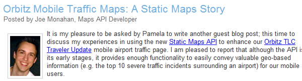
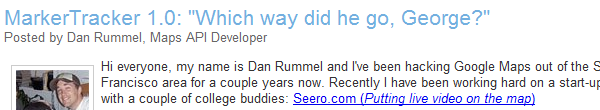

우수 개발자
##############

포럼이나 메일링리스트 등에서 여러분의 API를 사용하는 우수 개발자들에게 파악하고 
이들과 1:1로 접촉하고, 편안한 느낌으로 서로 친구처럼 연락할 수 있도록 하는 것은 매우 
중요하다.

일단 최고의 개발자가 누군지 알아야 이들과 함게 더 좋은 API 서비스를 제공하고더 좋은 
커뮤니티를 만들 수 있다. 그들에게 미래의 API에 대한 조언을 구할 수도 있고, 그들이 만들고 
커뮤니티에 제공할 수 있는 유용한 샘플 코드를 제안할 수도 있다. 

따라서 먼저 
:ref:`어떻게 그들을 찾고 <finding-them>`,
:ref:`그들과 연락하고 <contacting-them>`, 
:ref:`보상하는지 <rewarding-them>` 등을 미리 알아야 할 필요가 있다.

.. _finding-them:
 

개발자 찾기
***************

우수 개발자는 여러 가지 타입이 있고, 여러 곳에서 그들을 찾을 수 있다. 

포럼 사용자
===========

가장 눈에 띄는 우수 개발자는 적어도 포럼에서 대부분의 시간을 보내는 사람들 또는 글 갯수가
상위에 있는 사람들이다. 그들은 일반적으로 웹사이트 호스팅 샘플코드를 가지고 있으며, 
포럼에서 본인의 코드를 제공하면서 질문에 답한다. 훌륭한 개발자일 뿐만 아니라, 신출내기 
질문자에게 답변을 잘 조직화해서해 이치에 맞고 사실적으로 가르친다 

이러한 최고의 개발자를 찾으려면, 포럼에서 어떤 글쓴이가 상위에 있는지 둘러보고, 
그들의 답변의 질을 평가해보라.  대부분 포럼에서 어떤 사람이 가장 상위에 있는지 아는 방법은
간단하다.  구글 그룹에서, "그룹 정보"를 클릭하면 언제든 상위 글쓴이를 확인할 수 있고 
또한 매달 상위 글쓴이를 알 수 있다. 매달 체크하면 최근에 누가 가장 활동적이었는지 
아는 데 유용하다. 

또한 자주 글을 쓰지 않는 우수 개발자들이 찾기 위해 노력해야 한다. 누구도 이해하기 쉽도록
명쾌한 답을 주는 사람들로, 어떤 방법으로 찾아 내기는 쉽지 않다. 실제로 포럼의 게시물을
직접 볼 필요가 있고, 매우 유용한 게시물에 주의를 기울어야 한다. 

기술 문서 작성자
===================

일부 개발자는 기술적인 글쓰기에 재능을 가지는 경우가 있다. 그들은 각 자의 기술적 주제를 
가지고 모두에게 도움을 줄 수 있는 기술 사용법을 설명하거나(아마 설명서보다 더 나을 수 있다)
자신이 하고 있는 일에 대한 주제를 설명할 수도 있다. 

문서 작성자는 포럼에서 상위 글쓴이를 만들 가능성이 클 뿐만 아니라, 짧은 대답 대신에 
큰 조각으로 자신의 생각을 정리해 준다. (하지만 양쪽 모두 다 할 수 있는 문서 작성자를 
얻을 수 있다면 좋을 것이다!)

기술 문서 작성자를 찾기 위해, 우선 그들이 작성했던 기사를 찾아야 한다.  나는 우리 API에 
대한 대부분의 기사를 Google Alerts 와 트위터 검색을 통해 찾는다. 그렇게 발견된 문서는
설명서에서 외부에서 작성된 문서로 링크를 걸고, 이용자들이 방문할 수 있도록 해준다.
링크를 추가하는 것은 문서를 쓰는 글쓰기 능력을 갖춘 개발자들을 격려하는 방벚 중 하나다. 

책 저자
========

문서 작성자는 때로 책 저자로 변할 때가 있다.  이 세상에 있는 작가들에게 거대한 존경을 표한다. 
책을 쓰는 것 양적인 문제도 그렇지만  종이에 인쇄되는 기술적 주제에 관해 집필하는 것에 
자신이 없었다. 왜냐하면 내가 책 집필을 끝내는 순간 구식이 되어버릴 거라는 두려움 때문이다.
그러나 그들은 이러한 두려움 없이, 좋은 책을 집필하는것에 대해 나는 감사하다.
심지어 책이 기술적으로 같은 주제라도  완전히 다른 각도에서 접근할 수 있기 때문에, 책을 
더 가치있게 만든다.

예를 들어, 'Sterling Udell'은 Goolgle Mapplets 포럼의 우수 사용자 중 한명으로, 
'KML in Maps Mashups and Mapplets'라는 책을 썼다. 그의 책은 상당히 틈새 시장의 기술을 
주제로 하고있지만, 웹 프로그래밍 기술이 없는 사람을 가정으로 한 시각에서 접근을 하였고, 
훨씬 더 재미있게 만들었다. 기술적 배경이 없는 마케팅 팀 구성원들에게 이 책을 권유하게 되었다. 

자바스크립트 프로그래머가 아닌 사람들에게 가르칠 때 그의 방법을 사용했다. 사람들이 모두 
필수 기술(자바스크립트, 파이썬, 기타 등등)의 전문가라고 가정해서는 안된다. 때때로 그들은 
비프로그래머가 되어,  여러분의 API 가능성에 솔깃하고 이를 사용하는 것을 결정하도록 해야 한다. 
따라서, 이런 책이 있다면 여러 가지 각도에서 여러분의 API를 사용하도록 하는 중요한 방법이 
될 것이다.

대부분의 작가들은 출판 전에 그들의 책을 리뷰하고자 기술적으로 연락하기를 원할 것이다.
이것은 대부분의 도서 주제에 관해 알아내는 방법이다.  

오픈 소스 공헌자
========================

일부 개발자들은 정말 멋진 코드를 짠 후, 좋아하면서 오픈 소스로 공개하고자 한다. 그리고, 
github, 소스포지 또는 googlecode.com에 코드를 공개하는데 이를 쉽게 찾기가 어렵다.
 API 개발자들이  유용한 코드를 검색하기 쉽게 관련된 오픈 소스 라이브러리 디렉토리를 
만들거나 이를 모아두는 별도 오픈 소스 프로젝트를 만드는 것을 제안한다. 

각 구글 지도 API에 대해, 우리는 구글 코드 프로젝트에서 '유틸리티 라이브러리'를 관리한다. 
외관상으로는, 하나의 프로젝트지만 사실 같은 프로젝트에 호스팅 되어 있는 여러 라이브러리의 
모음집이며 소스 코드 및 문서를 일관성 있게 모아둔 곳이다. 오픈 소스 개발자들이 직접 
이브러리에  기여할 수 있도록 유도하며, 작업한 내역을 남기도록 하고 하였다. 

개발자들이 프로젝트에 참가하도록 유도하기 위해, 우리는 메인 프로젝트 페이지에 링크를 
게시하고, 블로그 포스트에 새로운 라이브러리 출시하는 링크를 제공한다.
물론, 그들 스스로 가서 하는 개발자들도 있다. 몇 가지 환경설정을 자신의 개인 호스팅에서
직접 하거나 (아마도 라이센스 이슈 때문일 듯), 아직 알려지지 않은 오픈 소스 유틸리티 
라이브러리이기 때문이다. 우연히 관련 오픈 소스 프로젝트를 발견했을 때, 그들이 함께하기를 
원한다면 저자에게 문의를 해야 한다. 그들이 원할 수도 있고, 아닐 수도 있겠지만, 연락을 안할 
필요는 없다. 

jQuery는 '서드-파티 플러그인'에 대한 디렉토리 접근 방식을 취하고 있다. 개발자는 중앙 갤러리에
플러그인에 대한 정보를 제출하게 하고, 별점, 필터 및 검색과 같은 기능을 제공하도록 한다. 
이러한 접근 방법은 좀 더 확장성이 있도록 해 주었고, jQuery가 세계에서 가장 인기있는 
자바스트립트 프레임워크 만큼, 확장 가능한 접근방식을 통해 혜택을 제공해 주고 있다. 
오픈 소스 개발자들과 1:1 연락의 기회가 줄어드는 것을 의미하지만 jQUary 개발자들은 메일링 
리스트나 기타 보조 수단을 통해 서로 알 수 있다. 

유료 사용자
============

매일 여러분의 API를 사용하기 위해 돈을 지불하는 사람들이 있다.  때로 여러분은 위의 경로를
통해 이러한 개발자들을 발견하게 된다.  이들이  포럼에 글을 쓰는 것은 흔하지 않다는 사실을 
알게 되었다.그들은 작업하는 것에 관련한 정보를 누설하지 않아야 하고, 법적인 장애물이 있다.

지도 API에서 자신의 회사를 위해 더 많은 사용량을 요청하는 이메일을 보낼 때, "유료 사용자"의
대부분을 만났다.  지도 API는 geocoder의 http 요청수를 제한하기 때문에 대형 웹 사이트는 
더 많은 할당량을 요구한다. 그들이 엔터프라이즈 API 고객이라면, 자동적으로 더 많은 할당량을 
얻을 수 있지만 그렇지 않으면  추가 할당량을 요청해야 한다.

이러한 요청 이메일이 가장 유용한(그리고 무작위의) 연결에 도움을 준다. 훌륭한 지도 이용 
웹 사이트가 어디인지 쉽게 알수 있었다. 사용량 추가 요청을 메일로 주고 받는 것은 원시적인 
시스템이기 때문에 미래에는 자동화된 무엇인가로 대체 될 가능성이 높다.  하지만, 나라면 
그것을 바꾸지 않을 것이다. 개발자들과 만날 수 있는 훌륭한 시스템이기 때문이다.

API 사용에 큰 문제점이 있거나 하지 않는다면 가급적 무언가에 제한을 둘 수 있고, 제한을 
해제하기 위해 여러분의 연락을 요구하는 진지한 개발자도 있을 것이다. 쓰레기 같은 요청을 
받을 수도 있지만, 좋은 요청을 얻고 사람을 찾을 수 있다. 

앞에서 언급했듯이, 구글 지도 API는 엔터프라이즈 기능을 제공하는데, 서비스 지속 가능성 및 
내부 지원 등 여러 가지 이유로 인해 유료로 지불하거나 제휴 계약을 필요로 한다. 
가끔 엔터 프라이즈 API 사용자와 교육 또는 컨설팅 회의를 개최하며 그러한 방법으로 그들을 
만나다. 공식적으로 그렇게 개발자들을 만날 때, 친근한 관계를 형성하기는 조금 어려울 것이다. 
그들과 식사를 하고 한잔 할 구실을 마련했고  평범한 관계를  만들어 나갈 수 있었다. 
API를 사용하기 위해 돈을 지불할 때, 잠시 동안만 사용할 가능성이 있어도  서로에게 좋은 조건이
될 수 있도록 도와준다. 

연락하기
*********
이제 오픈 API가 제공되는 각종 영역에서 어디서 우수 개발자을 찾아야 하는지 알 것이다. 
이제, 여러분은 그들과 연락할 필요가 있다.

우수 개발자를 포럼이나 웹 주위를 배회하면서 찾은 경우, 여러분은 소개 메일을 보내야 한다.
메일은 본인 소개와(명확하지 않더라도), 커뮤니티 기여에 도움을 주는 것에 대해 고맙다는 인사와
함께 만들어 낸 코드와 문서를 인지하고 있으며, 어떻게 API를 사용하게 된건지 물어 보아야 한다.
목적은 바로 대화를 통해 사람을 알아가고 한 두 차례 메일 교류로 친구가 될 수 있을 것이다.  

여러분이 실제로 그들과 같은 도시에서 살고 있고, 시간과 의지를 가지고 있다면  동료에게 소개해줄
수 있는 사무실에 초대해 차를 마시거나 식사를 할 수 있다. 또한 외부에서 개발자 그룹들을 초대해
만날 수 있고, 그들끼리 서로 만날 수 있다. (경쟁사 직원을 초대하는 것에만 주의만 하면 된다 - 
우리가 한번은 점심에서 서로를 발견했을 때, 두 부동산지도 API 사이트간 대결을 했었다~)

보상 방법
**********

서로 연락하고 알게 되었으면, 감사의 마음을  좀 더 확실하게 표현하는 것이 좋다. 여러분이 
개발자에게 보상할 수 있는 몇 가지 방법이 있다. 

무료 선물
================

첫번째 무료 선물인데, 가급적 여러분의 회사나 제품 로고가 들어간 희귀 아이템(Rare Items)을 
선물하는 것이 좋다.

구글 개발자 지원 그룹에서는 늘 구글 브랜드 상품을 비축해둔다 - 구글 로고가 박힌 머그컵, 물병
및 스트레스 완화 장치.  우리는 취향이 독특한 개발자를 위해 독특한 schwag을 가지고 있다. 
웹 사이트 QR코드가 박힌 티셔츠와, 안드로이드 인형, "API GURU"가 박힌 후드셔츠, 그리고 내가 
좋아하는 시 구절과 같이 우리 API를 사용한 마크네틱 포트리 등이다. 이 물건들은 다른곳에서 
얻을 수 없고, 찬구들에게 자랑하도록 도와 주기 위해 만든 물건이다.   

여러분이 아이템 중 하나를 비축하기 위해 선택한다면, 티셔츠로 해라. 누구나 무료 티셔츠를 
좋아한다. (폴로 티셔츠만 입는 사람은 제외) 마케팅 관점에서 티셔츠는 여러분 브랜드를 위한 
엄청난 무료 홍보 수단이다. 티셔츠를 위한 예산이 적다면, 스티커나 펜과 같이 저렴한 아이템들을
비축해야 한다.

여러분이 개발자에게 이메일을 보낼 때, 작은 감사의 표시로 그들에게 몇 가지 무료 선물을
제공하는 방법을 설명하고, 그들의 티셔츠 사이즈와 주소를 물어봐라. 다음 배송 시 짧은 감사 
손편지를 넣어라.

객원 블로거
===========
만일 여러분의 API가 블로그가 있다면, 우수 개발자의 작품을 강조하기 위해 블로그를 사용할 수 
있고, 포트폴리오나 회사 등을 보여줄 수 있는 장소를 마련해 주면 좋다. 중요한 점은 블로그 글이
단순히 광고의 장이 되도록 내버려 두지 않는 것이다. 기본적으로 다른 개발자들이 배울 수 있는 
기술적 통찰력(또는 더 좋은 코드)을 제공해야 한다. 

지도 API에서 우리는 최고의 개발자로부터(그리고 몇몇 상당히 큰 회사)좋은 방문자 블로그 글을 
올린다. (`Travellr`_, `Orbitz`_, `LonelyPlanet`_, and `ArcGIS`_. 등)

|orbitzblog|

지도 API 오픈 소스 라이브러리에 위키 프로세스를 공개하는 것은 실제 출시단계 중 하나로서 
블로그 글을 작성하는 것을 포함하고, `작성 가이드라인 <http://code.google.com/p/gmaps-utility-library-dev/wiki/BlogPostGuidelines>`_ 을 제공한다.  글에 약력과 사진으로 
함께 올리게 하고 우리가 규모가 큰 개발자 커뮤니티와 대면할 수 있도록 도와준다. 
예를 들어, 처음 시작하는 사람들은 `Marker Tracker launch post`_ 등을 확인해보라. 

|markertrackerblog|

잘 되면 객원 블로거는 서로 윈윈할 수 있다. 웹 사이트 트래픽을 얻을 수 있고 개발자를 채용하는
데도 도움이 되고 API팀은 질 높은 블로그 글을 얻는 기회가 된다.

.. _Travellr: http://googlegeodevelopers.blogspot.com/2009/06/travellr-behind-scenes-of-our-region.html
.. _Orbitz: http://googlemapsapi.blogspot.com/2008/03/orbitz-mobile-traffic-maps-static-maps.html
.. _LonelyPlanet: http://googlegeodevelopers.blogspot.com/2008/07/using-static-maps-and-http-geocoding-to.html
.. _ArcGIS: http://googlegeodevelopers.blogspot.com/2008/08/using-google-maps-to-visualize-arcgis.html
.. _posting guidelines: http://code.google.com/p/gmaps-utility-library-dev/wiki/BlogPostGuidelines
.. _Marker Tracker launch post: http://googlemapsapi.blogspot.com/2008/03/markertracker-10-which-way-did-he-go.html

테스트 사용자
===============

새로운 API나 기능을 테스트하기 위해서 신뢰할 만한 사람들을 알고 있는 것이 좋다. 기밀 유지
각서(NDA)를 작성하고 기능을 테스트하는 것인데 상위 개발자나 주요 포럼 회원들에게 맡길 수 
있을 것이다. 

우수 개발자가 유료 테스트 프로그램에 참여해서 버그나 기능 제안은을 하는 것이 매우 좋다. 
그들은 문서 작성 및 샘플 코드나 데모 작성에도 도움을 줄 수 있다. 그들은 그 이후에도 자기가
관여했던 API에 대해 관심있게 사용할 것이다.  그 개발자가 활동적인 포럼 사용자라면 포럼에서 
새로운 사실에 관련한 질문에 답할 수 있는 메인 개발자가 되어야 한다 만일 여러분이 새로운 API를
만들고 커뮤니티를 지원하는 완벽한 기능을 제공하면 엄청난 호의를 받을 수 있다. 하지만, 그것은
거의 불가능하고 커뮤니티를 구축하는 데만 수 개월, 수년이 걸릴 수 있다. 

API팀의 이점은 여기에 있다 - 새 기능이 나오기 전에 우리는 피드백을 얻을 수 있고, 하위 호환성을
유지하는 것에 관해 걱정하지 않고 조정할 수 있다. 어떻게 그것을 사용하는지 보여줌으로서, 무료로
커뮤니티 지원을 얻을 수 있다 개발자에게 주어지는 혜택은 자신이 관심있어 하는 API에 달려 있으며
그들이 프리랜서 개발자라면 그들이 직업을 얻을때까지 지원해준다 (이력서에 테스터라고 기입할 수
있다)

우리가 지도 API v3를 제작했을때 첫번째 테스트 프로그램을 가질 수 있었다.  API에 대한 중요한 
피드백을 받지 못했지만 , 개발자들은 빠르게 데모 및 확장 기능을 만들 수 있다. 
외부에 오픈했을 때, 갤러리에 이미 십여개의 라는 외부 데모를 가지고 있었고, 콘퍼런스와 블로그 
글에서 그것들을 보여줄 수 있었다.  Gabriel Svennerberg 라는 개발자는 심지어 여러 개의 글을 쓰고
지도 API를 사용하여 책을 제작하고 있었다. 

그를 테스터 프로그램 제작에 초대하는 것이 중요할 것이라 생각했고, 마침 그가 책의 주제로
계획하고 있던 시기와 맞아떨어졌다. 

지도 api v3의 테스터 프로그램이 성공적인 이래로, 우리는 플래쉬 api를 3차원 관점에서 보는 것을 
테스트하기로  결정했다.  플래쉬 api 개발자 커뮤니티가 있는지도 몰랐던 나로서는 누가 이
 프로그램에 초대되는 것인지 아는것만으로도 흥미로웠다.  플래쉬 api는 겨우 일년이 지났지만, 
아직 플래쉬 API 커뮤니티가 없다는 점은 유감이다.

그래서 나는 최근에 모든 플래쉬 오픈 소스 라이브러리 작성자들의 활동적인 포럼 글쓴이들 중 
몇명을 초대했다.  그들은 플래쉬 API와 관련해 블로그 글을 작성했고, 일본 개발자들은 굉장한 
데모를 마친 상태다.

우리가 플래쉬 api를 3차원 시각에서 작업중이라 미리 발표한 후로, 나는 이것을 콘퍼런스에서도 
말하고 흥미로운 개발자들을 찾는 방편으로 삼고 있다. 예전에 3차원 플래쉬 그룹에서 일할 때 
몇 가지 기능을 해킹한적이 있다고 트윗한적이 있다. 답글을 통해 몇몇 개발자를 발견할 수 있었다. 
이 개발자 집단은 API를 이용한 대단한 데모를 제작했고, 더 중요한것은 API를 이용해 우리가 전혀 
생각하지 못했던 것을 만들 수 있고 새로운 기능에 대해서 더 흥분을 느낄 수 있다. 

지도 APi v3 그룹 보다 여기서 더 많은 피드백을 받을 수 있었는데, 이것은 우리가 단순히 기존의 
API를 재작성하게 하는 것보다 그들에게 무언가 완전히 새로운 놀이감을 제공하기 때문이다. 
여러분이 신뢰할만한 개발자에게 무언가 다른 놀이거리를 준다면, 그들이 그것을 가지고 
더 열심히 노력하고 리포팅 하는것을 보게 될 수 있다. 

알려주기
========
때로 개발자의 작업을 칭찬하기 위해 할 수 있는 모든 것을 할 필요가 있는데, 적절한 웹 페이지에
링크를 거는 것이다. 지도 API에 관해, 데모 갤러리에 있는 데모에 링크(쉽게 소스 코드 샘플을 
보고 배울 수 있다)걸기, 기사 섹션에 기사 링크를 걸어놓았다.

API를 사용하는 웹사이트의 경우, API 소개 페이지에 주요 이용 사례를 게시하고 이를 Twitter에
올려 줄 수 있다. 어떤 것이 사람들의 흥미를 끌지 모르기 때문에 가급적 많은 것을 트윗하고 
리트윗해주면 좋다. 

일단 무언가에 링크를 걸었거나 트윗을 했거나 둘 다를 했을 때, 개발자가 그것에 대해 알 수 있게
해주면 공유해준 여러분에게 감사할 것이며, 또한 트래픽이 어디서 오는지 이해할 수 있을 것이다. 
